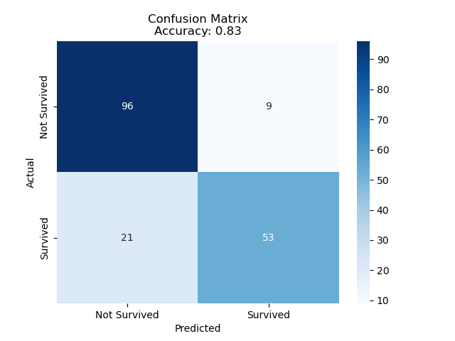
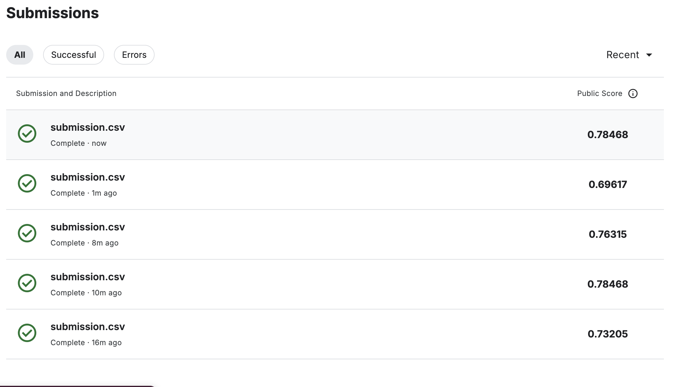

# Titanic Survival Prediction

## CRISP-DM Framwork

1. **業務理解 (Business Understanding)**
   在這個階段，我們確定了問題背景和目標。以泰坦尼克號生存預測為例，目標是基於乘客的特徵（如性別、年齡、船艙等）來預測他們是否會生存。

2. **數據理解 (Data Understanding)**
   在程式碼中，我們載入了訓練數據集 `train.csv`，這一步驟幫助我們了解數據的結構和特徵。

3. **數據準備 (Data Preparation)**
   這一部分包括數據的清理和轉換，使其適合用於建模。程式碼中的操作包括：

   - **處理缺失值**：填補 `Age` 和 `Fare` 的缺失值，並處理 `Embarked` 的缺失值。
   - **特徵工程**：創建新的特徵如 `FamilySize` 和 `IsAlone`，這些有助於模型捕捉乘客的社交環境。
   - **類別變量編碼**：將 `Sex` 轉換為數值類型，並對 `Embarked` 進行獨熱編碼。

4. **建模 (Modeling)**
   在這個階段，我們選擇了適合的模型，這裡使用了隨機森林分類器。以下是建模的步驟：

   - **切分數據集**：使用 `train_test_split` 將數據分為訓練集和測試集。
   - **模型訓練**：通過隨機森林進行訓練。
   - **超參數調優**：使用 `GridSearchCV` 對模型進行超參數優化，選擇最佳的模型配置。

5. **評估 (Evaluation)**
   這個階段的主要目的是評估模型性能。程式碼中：

   - **預測測試集**：使用最佳模型進行預測。
   - **混淆矩陣**：生成混淆矩陣以視覺化模型的預測效果，並計算準確率。

6. **部署 (Deployment)**
   結果的輸出，這可以看作是將模型應用於真實世界的一個步驟。

---

## Confussion Matrix

---

## Submission screenshot

